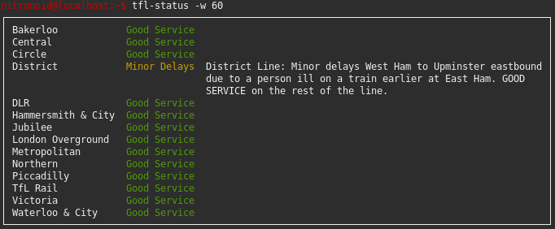

# tfl-status
A simple CLI tool for querying and displaying TFL line status in the terminal, written in Rust.

## Build
Like most Rust projects, this repo uses Cargo as a build system and package manager.
```
# Build
cargo build --release
```

## Installation
Again, Cargo handles this for us.
```
# Install
cargo install --path /path/to/repo
# Uninstall from inside the project directory
cargo uninstall
```

## Usage
Color highlighting is included.
```
$ tfl-status
┌───────────────────────────────────────────────────────────────────────────────────────────────┐
│ Bakerloo            Good Service                                                              │
│ Central             Good Service                                                              │
│ Circle              Good Service                                                              │
│ District            Minor Delays  District Line: Minor delays West Ham to Upminster eastbound │
│                                   due to a person ill on a train earlier at East Ham. GOOD    │
│                                   SERVICE on the rest of the line.                            │
│ DLR                 Good Service                                                              │
│ Hammersmith & City  Good Service                                                              │
│ Jubilee             Good Service                                                              │
│ London Overground   Good Service                                                              │
│ Metropolitan        Good Service                                                              │
│ Northern            Good Service                                                              │
│ Piccadilly          Good Service                                                              │
│ TfL Rail            Good Service                                                              │
│ Victoria            Good Service                                                              │
│ Waterloo & City     Good Service                                                              │
└───────────────────────────────────────────────────────────────────────────────────────────────┘

# ...or if you haven't installed
$ cargo run --release
```

Example output with colors.
<p align="center">

</p>

## References
I wrote this project for fun and it is based on the bash implementation by [smallwat3r](https://github.com/smallwat3r/tubestatus)
A python implementation can be found [here](https://github.com/nitronoid/tube-status)

